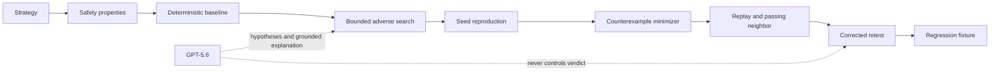

# Architecture

Market Fuzzer has two intentionally separate layers:

```text
Primary product path
  Strategy definition + safety properties
    -> compact deterministic POV state machine
    -> bounded adverse search and seeded reproduction
    -> minimization + verified passing neighbor
    -> exact fragile/corrected comparison
    -> replay + YAML/JSON regression fixture

Secondary research infrastructure
  WorldSpec -> synthetic world -> agents -> exchange/calibration/artifacts
```



## Product harness

`app/product.py` is the accounting authority for the browser’s Market Fuzzer workflow. Each run models discrete time steps, actual volume, delayed observed volume, observation latency, pending orders, fills, parent-order remainder, realized participation, completion, a documented deterministic shortfall proxy, strategy decisions, and replay events.

The fragile POV intentionally sizes from stale observed volume and ignores pending orders. The corrected POV includes pending quantity in its budget and applies a fill-time participation guard. Both receive identical scenario inputs, parent-order parameters, properties, and seeds in comparison runs.

`run_search()` uses a deterministic bounded grid, targets the enabled participation property, selects the least-severe qualifying candidate, recomputes all minimized evidence, and verifies a passing neighbor. `export_fixture()` preserves the exact strategy ID, type, version, parameters, scenario hash, seeds, safety properties, expected targeted result, policy versions, and reproduction command.

## Research infrastructure boundary

The repository also contains a broader synthetic-market research engine under `app/world/`, `app/agents/`, `app/exchange/`, `app/calibration/`, `app/experiments/`, and `app/analytics/`. Those modules support the earlier world/calibration experiments. They are not silently claimed as the exact backend of the compact Market Fuzzer harness.

The current product should therefore be described as a **compact deterministic market test harness**, not a full institutional exchange simulator. The older exact matching engine remains useful research infrastructure, but the product acceptance tests exercise `app/product.py` directly.

## AI boundary

GPT-5.6 is optional. It may generate schema-constrained failure hypotheses and explanations grounded in measured evidence. It never sets prices, volumes, fills, accounting entries, safety-property values, reproduction confidence, or PASS/FAIL outcomes. The no-key deterministic path is complete.
