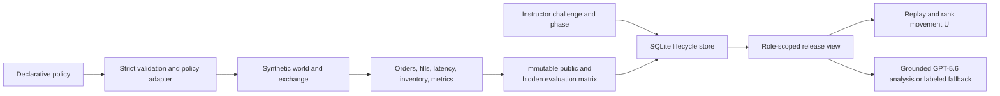

# Architecture

Quant Challenge Arena is one product with four deliberately separated layers:

```text
Primary        Execution Challenge Arena
Secondary      Research/positions challenge (experimental)
Advanced       Market Fuzzer developer lab
Infrastructure Synthetic world, agents, and price-time-priority exchange
```

The homepage and primary `/api/arena/execution/...` routes belong to the Execution Challenge. The older research/positions APIs remain under `/api/arena/challenges/...`; they are not the homepage or the basis of the execution leaderboard. `/market-fuzzer` preserves the protected developer-tool milestone.

## Execution Challenge



Key responsibilities:

- `app/execution_arena.py` defines the versioned policy submission, built-in benchmark policies, exchange adapter, public and hidden evaluation matrix, score decomposition, and challenge public brief.
- `app/simulation.py` and `app/exchange/` own the deterministic market lifecycle: observations, actions, order arrival, acknowledgments, fills, cancels, inventory, and replay evidence.
- `app/execution_store.py` owns restart-safe product state in SQLite: server-generated demo identities and sessions, challenges and their hidden-world manifests, phase history, practice runs, final submissions, immutable hidden evaluations, per-world results, leaderboard snapshots, qualitative challenge-design drafts, feedback reports, and audit events.
- `app/execution_challenge_designer.py` validates instructor constraints, maps GPT-5.6 educational intents to an approved intervention allow-list, rejects numeric world construction, and provides a deterministic no-key design.
- `app/execution_feedback.py` builds the allow-listed evidence package, validates structured feedback, handles refusals/incomplete output, and provides the clearly labeled no-key fallback.
- `app/api/app.py` enforces the student/instructor boundary and translates stored records into public, released, and instructor-only views.
- `app/static/arena.html`, `arena.js`, and `arena.css` provide the student/instructor workflow. Raw evidence is secondary to the visible policy, replay, and ranking views.

The challenge adapter under `app/challenges/` defines a small shared contract (`public_brief`, `validate_submission`, `run_public`, `run_hidden`, and `release_view`). Execution is the primary implementation. The legacy research challenge is exposed as a secondary adapter without forcing either product through the other product’s submission schema.

## Persistence and phases

The deterministic simulator is stateless; the product lifecycle is not. `ArenaStore` initializes a deterministic SQLite schema and uses one short transaction per operation. State changes and their audit entries commit together. Phase transitions, release timestamp plus phase, and quota count-plus-insert operations use immediate write transactions; a concurrent practice or final-submission request therefore cannot pass a stale count and exceed its stored limit in the supported single-database deployment. Tests point `ARENA_DB_PATH` at a temporary database; Docker points it at `/data/arena.sqlite3` in a named volume.

Allowed transitions are exact:

```text
draft → public_practice → submission_locked → hidden_evaluation → released → archived
```

Every transition records actor, time, previous state, new state, and reason in the same transaction as the phase update. Practice and final-submission limits are stored with the challenge. The hidden matrix is stored once and reused; release atomically adds the release timestamp, advances phase, and records its audit event without changing the underlying scores or matrix hash.

## Security and release boundary

The browser cannot choose a hidden world or evaluation seed. Public practice derives `public_world_variant` from the stored challenge and uses the canonical public seed `PUBLIC_SEED = 42`. The challenge's protected world IDs are persisted as a server-only manifest. Hidden evaluation loads that exact manifest and the internal `SEEDS = (41, 42)` tuple, then requires an instructor session in the correct phase. A request cannot replace either authority.

`ARENA_DEMO_AUTH=1` enables signed, HttpOnly, SameSite=Lax, twelve-hour demo-session cookies whose hashes and server-generated identities are recorded in SQLite. The request supplies a role, not a user ID. A valid role-specific cookie resumes the same student or instructor identity across reload. A stable `ARENA_SESSION_SECRET` of at least 32 bytes also preserves that cookie across application restart; otherwise demo mode creates a process-random secret and restart deliberately invalidates it. Instructor issuance additionally requires a constant-time match against the server-only `ARENA_DEMO_INSTRUCTOR_CODE`; the code is never stored in the cookie or returned to the browser.

Cookies are `Secure` by default. Automatic HTTP compatibility requires both a loopback peer and loopback URL host (or Starlette's exact in-process test scope); `ARENA_COOKIE_SECURE=1` forces secure cookies, while `ARENA_COOKIE_SECURE=0` is valid only for demo mode and remains ineffective on a non-loopback peer. Invalid override values fail closed. A normal client-supplied role header has no authority. `ARENA_TEST_AUTH=1` enables `X-Test-Role` only when the ASGI peer is exactly `testclient`, so a real network request cannot activate the bypass. Demo authentication is disabled by default in Compose.

The API keeps a bounded process cache of `ArenaStore` objects keyed by the fully resolved `ARENA_DB_PATH`. Initial schema creation and default-challenge seeding occur once per cached store; tests or processes that change the configured path receive a different store instead of reusing a stale global singleton.

Before release, a student cannot retrieve hidden identifiers, parameters, hashes, replays, leaderboard rows, or feedback. After release, the student receives only the declared aggregate result fields. Raw matrices, world-level results, hashes, and the audit trail remain instructor-only.

This is a hackathon demo boundary, not OAuth, OIDC, an LMS integration, CSRF hardening for a public multi-tenant deployment, or institutional identity assurance.

## Evaluation and caching

The public benchmark and protected evaluation deliberately have different seed contracts:

```text
public:    one policy × stored public world × seed 42
protected: one policy × persisted hidden-world manifest × SEEDS (41, 42)
```

The immutable matrix records challenge and policy identity, world/seed results, public and robustness rank, and a deterministic matrix hash. SQLite de-duplicates stored hidden evaluation by challenge and matrix hash, so page loads do not recompute the matrix. A version change invalidates reuse by changing the derived hash.

## GPT boundary

The instructor-only challenge designer can create a schema-valid qualitative draft from approved intervention and policy-control IDs. The draft and its audit event are persisted, but the model cannot provide numeric market parameters, seeds, prices, orders, fills, outcomes, scores, or ranks and cannot create or mutate the persisted world manifest.

The evidence analyst receives only post-release aggregate evaluation fields plus bounded stable IDs derived from the student's public replay. Each quantitative statement must cite an allowed evidence ID, canonical metric name, and exact supplied value. The validator rejects unknown IDs, invented metrics or numbers, pre-release hidden content, unsafe financial/production claims, output that contradicts deterministic rank, refusals, and incomplete schema output. A validated or deterministic-fallback report is persisted and recovered on subsequent requests, including after restart. Raw per-world evidence is never added to the student feedback package and remains instructor-only. The model has no API path that writes market events, fills, metrics, scores, ranks, phase, release state, or worlds.

## Preserved systems

`app/arena.py` is the secondary research/positions assessment. `app/product.py` is the compact deterministic Market Fuzzer harness. The broader world and exchange modules are shared research infrastructure. The protected Market Fuzzer tag remains the provenance boundary; the Execution Challenge builds on infrastructure without deleting or relabeling that milestone.
