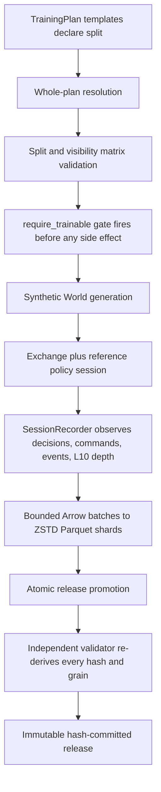

# The `fwf-corpus-v1` Synthetic Training Corpus (M10.7)

M10.7 turns Financial World Factory's market-process machinery into a
**training-data factory**. The benchmark side (see
[SYNTHETIC_EXCHANGE_BENCHMARK.md](SYNTHETIC_EXCHANGE_BENCHMARK.md)) generates
sealed evaluation worlds; this feature adds the guarded path that generates
declared-`TRAINABLE` worlds and exports their complete trajectories into a
versioned, immutable, hash-committed Apache Parquet release.

Everything in a release is produced by FWF's deterministic synthetic engine.
**No real historical prices, no perturbed historical order-book rows, no
yfinance/Alpaca/WRDS data ever enters a training row.** Real data remains a
calibration input elsewhere; it is never training-row source material.

## What one release contains

Seven Arrow/Parquet tables, each with an explicit `fwf-corpus-v1` schema
(`app/corpus/schema.py`), a declared grain, and a per-table version:

| table | grain | one row per |
| --- | --- | --- |
| `episodes` | episode | generated world/session episode: split, plan, family commitment, digests, counts, terminal score |
| `securities` | security | synthetic security per episode |
| `daily_bars` | bar | episode x security x synthetic trading day (real engine OHLC, not synthesized) |
| `agent_decisions` | decision | decision at the boundary: exact observation JSON, exact validated action JSON, ledger indices, snapshot reference |
| `exchange_commands` | command | canonical exchange command (submit/cancel/replace), recorded at creation time for background *and* agent flow |
| `exchange_events` | event | `OrderEventV2`, in immutable-ledger order, with contiguous `event_ordinal` |
| `book_snapshots` | snapshot | aggregate L10 depth immediately before each recorded decision: highest bid first, lowest ask first, aggregate displayed quantities |

There is **no dense per-step reward**. The benchmark's outcome model is a
terminal episode score; `episodes.reward` is nullable forward-compatibility and
stays null in `fwf-corpus-v1`. A later RL adapter defines its own reward contract.

Observation/action documents are stored as canonical JSON strings of the
published protocol (`StrategyObservationV2` / `StrategyActionV2`, schema 2.0)
with useful scalar columns extracted alongside for cheap analytics. Evaluator
metadata (partition, family visibility, registry internals) is never serialized
into an observation, and the validator rejects private-family markers
row-by-row.

## Leakage safety is structural



* The **split is explicit**. Every `EvaluationWorldTemplate` declares
  `DatasetSplit`; TRAINABLE is never inferred from family visibility. The
  validation matrix enforces: TRAINABLE means public family + `training`
  partition; PUBLIC_EVAL means public family + evaluation partition; SEALED_EVAL
  means evaluator-private family + evaluation partition. `m10_7_training_v1`
  declares TRAINABLE everywhere; all three published families appear, each under
  both published ecologies.
* **Symmetric guards.** The corpus build path raises
  `SEALED_EVAL_NOT_TRAINABLE` (`SealedEvaluationExportError`, extended to any
  non-TRAINABLE world) for a plan containing PUBLIC_EVAL or SEALED_EVAL worlds,
  *before generating anything*: no world generated, no port constructed, no
  directory created, no file written. The benchmark (`run_benchmark`) raises
  `TRAINABLE_PLAN_IN_BENCHMARK` for a plan containing TRAINABLE worlds, also
  before world generation.
* **No evaluator-private path.** The training plan can only name public
  families; a private family tagged TRAINABLE, PUBLIC_EVAL, or SEALED_EVAL fails
  whole-plan validation. The participant-facing CLI cannot name plans,
  registries, families, or modules at all.

## Recording seam

`BenchmarkSession` accepts an optional `SessionRecorder`. Hooks fire at four
points: session start, the decision boundary (pre-decision aggregate L10 depth
via the read-only `MatchingExchangeV2.depth_snapshot`, plus the exact
observation and the exact validated action, plus per-decision ledger indices),
command creation, and bounded event deltas via the narrow ledger cursor
(`event_count` / `events_since`). The recorder is a pure observer: with no
recorder the session is byte-identical to M10.6.1, and the equivalence test
proves identical `SessionResult`, ledger/market/action digests, event and trade
counts, score, fills, positions, and equity curve with a recorder installed.

Memory is bounded by construction: writer buffers target 10,000 rows with a
50,000-row row group and a 250,000-row shard roll; event deltas flush
incrementally. Peak instrumented buffering on the acceptance release was
exactly 10,000 rows/table, regardless of the 1.8M+ event total.

## Immutability and hashes

A release directory must not exist to be written; the build writes into a
sibling `.<name>.building` directory and atomically renames it on success. A
failed build leaves no release directory and no temporary directory. Shards use
deterministic names `part-00000.parquet`, ... and ZSTD compression under an
explicit Arrow schema.

Two hash layers live in `manifest.json`:

* **logical**: per-table SHA-256 over canonical rows
  (sorted-key compact JSON of each row, newline joined) in write order. The
  validator re-reads the Parquet and independently recomputes it; it trusts
  nothing on the writer side.
* **physical**: per-shard SHA-256 and byte count inventory, so a deleted,
  swapped, or corrupted shard is named exactly.

`release_digest` commits to schema, plan, generation parameters, table logical
hashes, and row counts -- and to nothing environmental (no paths, no timestamps,
temp names). Two builds with identical settings produce the identical digest,
the identical manifest bytes, and byte-identical shards under the pinned
PyArrow.

## Commands

```bash
# The acceptance corpus (32 worlds, 8 securities, 5 days, 30 steps/day, depth 10, TWAP)
python -m app.cli corpus build \
  --output artifacts/corpora/m10-7-smoke \
  --task execution \
  --policy twap \
  --worlds 32 \
  --securities 8 \
  --days 5 \
  --steps-per-day 30 \
  --seed 20261007

python -m app.cli corpus validate artifacts/corpora/m10-7-smoke
```

Both commands exit `0` on success. `fwf corpus build` always uses
`m10_7_training_v1`, the public process registry, and the published ecologies;
`fwf corpus validate` re-derives every integrity claim from the release itself
and exits `1` with a stable code otherwise: `MANIFEST_MISSING`,
`MANIFEST_SCHEMA_UNKNOWN`, `FILE_MISSING`, `FILE_SHA_MISMATCH`,
`SCHEMA_MISMATCH`, `ROW_COUNT_MISMATCH`, `LOGICAL_HASH_MISMATCH`,
`DUPLICATE_EPISODE_ID`, `FOREIGN_KEY`, `DECISION_ORDER`, `SNAPSHOT_FK`,
`EVENT_ORDER`, `EVENT_COUNT_MISMATCH`, `COMMAND_ORDER`,
`BOOK_SNAPSHOT_INVALID`, `OHLC_INVALID`, `NUMERIC_INVALID`, `LEAKAGE_DETECTED`.

Programmatic trusted callers may inject registries/plans/policies through
`CorpusConfig` (`app.corpus.builder.build_corpus`); the exported episode ids,
seeds, digests, and validation guarantees are identical.

## Acceptance scale run

32 worlds x 8 securities x 5 days x 30 steps/day, depth 10, execution/TWAP,
seed `20261007`:

| metric | value |
| --- | --- |
| episodes | 32 |
| securities rows | 256 |
| daily bars rows | 1,280 |
| agent decision rows | 4,800 |
| exchange command rows | 1,139,655 |
| exchange event rows | 1,815,539 |
| book snapshot rows | 4,800 |
| Parquet shards | 18 |
| compressed size | ~58 MB |
| duration | ~131 s |
| events/sec | ~13,900 |
| release digest | `d900621a...607993fa` |

The event stream stays on the order of the >1M-event benchmark as required.
Instrumented max buffered rows per table was 10,000 (the configured bound),
proving corpora of this size never accumulate their streams in memory.

## Reader smoke

A consumer needs only `manifest.json` + the Parquet files: load episode
metadata, filter one episode, read its securities and daily bars, stream its
events in `event_ordinal` order, stream its decisions, and align each decision
with its `book_snapshot_id`; the snapshot touch agrees with the observation
document's best bid/ask because both came from the same pre-decision book state
(`tests/test_corpus_release.py::test_a_consumer_reads_a_release_without_simulation_objects`).

## Known limitations

* **No real historical price paths.** The synthetic-only guarantee is a property
  of the build path, not a filter; do not use the corpus as an empirical
  calibration source.
* **Background agents are interpretable archetypes**, not a calibrated
  institutional participant population.
* **`exchange_time_ns` is a deterministic logical clock** -- an ordered logical
  timestamp inside the benchmark kernel. M10.7 does not model real wall-clock
  exchange or network latency, and the dataset card says so explicitly to keep
  the tick corpus from being oversold.
* **Snapshots are decision-time L10 captures**, not a snapshot after every
  event.
* **The exchange is the Python reference implementation**
  (`MatchingExchangeV2`), not the eventual 100k-security accelerated engine.
* **Per-world ledger memory** still lives in the session (unchanged from
  M10.6.1); bounded *exporting* is what M10.7 delivered. Streaming the kernel
  itself is future work.
* Framework adapters (PyTorch, JAX, HF, RLDS) are deliberately absent; the
  neutral Parquet schema is the adapter boundary and comes first.

## Module map

```
app/corpus/schema.py     explicit fwf-corpus-v1 Arrow schemas and grains
app/corpus/recorder.py   SessionRecorder protocol, NullSessionRecorder, counters
app/corpus/writer.py     bounded buffer -> ZSTD sharded Parquet + streaming logical hash
app/corpus/builder.py    guarded build path, recorder sink, manifest, dataset card
app/corpus/validate.py   independent validator with stable failure codes
```

Session-side seam: `app/benchmark/session.py` (recorder hooks),
`app/exchange/v2_matching.py` (`depth_snapshot`),
`app/exchange/v2.py` (`events_since` cursor).
Benchmark-side gates and the training plan: `app/benchmark/plan.py`,
`app/benchmark/runner.py`.
